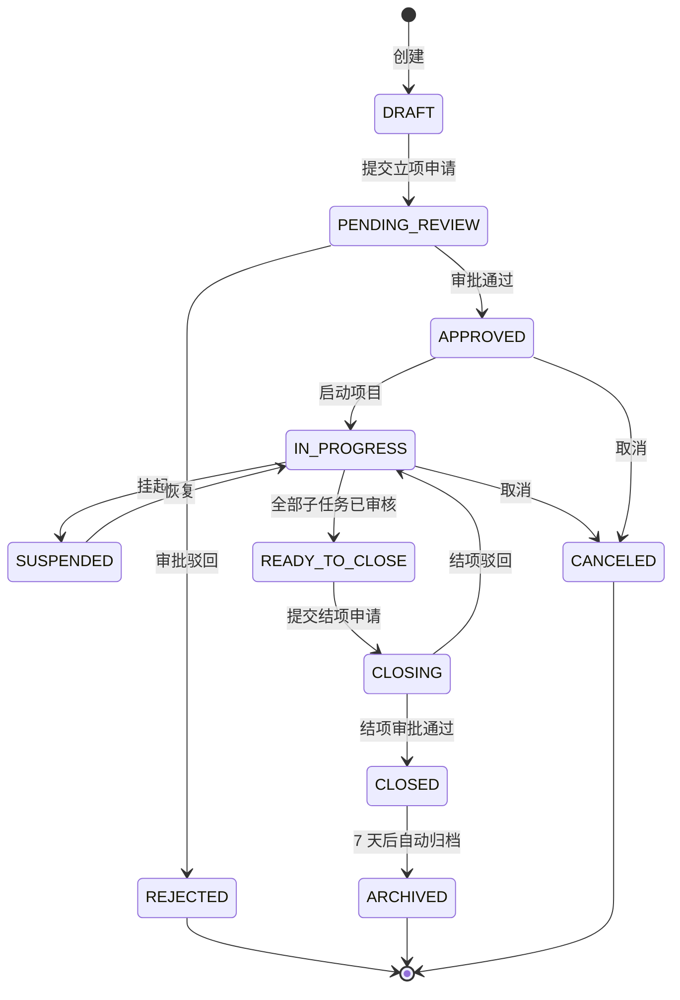

# 项目状态机

```mermaid
stateDiagram-v2
    [*] --> DRAFT : 创建

    DRAFT --> PENDING_REVIEW : 提交立项申请
    PENDING_REVIEW --> APPROVED : 审批通过
    PENDING_REVIEW --> REJECTED : 审批驳回
    REJECTED --> [*]

    APPROVED --> IN_PROGRESS : 启动项目

    IN_PROGRESS --> SUSPENDED : 挂起
    SUSPENDED --> IN_PROGRESS : 恢复
    IN_PROGRESS --> READY_TO_CLOSE : 全部子任务已审核

    READY_TO_CLOSE --> CLOSING : 提交结项申请
    CLOSING --> CLOSED : 结项审批通过
    CLOSING --> IN_PROGRESS : 结项驳回

    CLOSED --> ARCHIVED : 7 天后自动归档

    IN_PROGRESS --> CANCELED : 取消
    APPROVED --> CANCELED : 取消

    ARCHIVED --> [*]
    CANCELED --> [*]
```

## 关键触发

- `READY_TO_CLOSE` 由系统 Cron 每 5 分钟扫描：当所有子任务 = `APPROVED` 时自动置位
- `ARCHIVED` 由定时任务在 `CLOSED` 后 7 天自动置位
- 通知：每次状态变化通过 WebSocket 推送 + 站内信持久化
