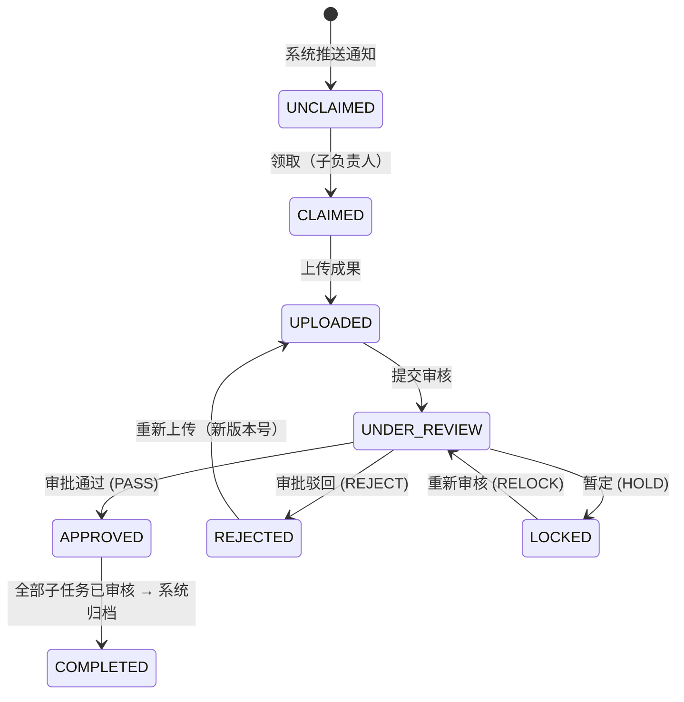

# 子任务状态机（流程图核心）

> 严格对应贵司提供的《项目任务管理系统流程图》PDF

## 合法转移表

| 起始状态 | 事件 | 目标状态 | 触发者 | 可重做 |
|---|---|---|---|---|
| `UNCLAIMED` | `claim` | `CLAIMED` | 子负责人 | 否 |
| `CLAIMED` | `upload` | `UPLOADED` | 子负责人 | 是 |
| `UPLOADED` | `submitReview` | `UNDER_REVIEW` | 子负责人 | 否 |
| `UNDER_REVIEW` | `review(PASS)` | `APPROVED` | PM | 否 |
| `UNDER_REVIEW` | `review(REJECT)` | `REJECTED` | PM | 是 |
| `UNDER_REVIEW` | `review(HOLD)` | `LOCKED` | PM | 是 |
| `LOCKED` | `relock` | `UNDER_REVIEW` | PM | 是 |
| `REJECTED` | `upload` (v+1) | `UPLOADED` | 子负责人 | 是 |
| `APPROVED` | `archive` (系统) | `COMPLETED` | 系统 | 否 |

## 关键不变量

- **PM 不能领取/上传子任务**（仅可审批/暂定/重新审核）
- **子负责人不能审批自己负责的子任务**（职责分离）
- **被驳回后必须新版本**（version+1），确保可追溯
- **全部 APPROVED 才进入 COMPLETED**（系统 Cron 每 5 分钟扫描）
